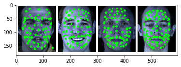

# Emotion-recognition

## Speaker Independemnt Emotion Recognition

### We have use SAVEE database, which consists of 120 videos of four professional actors with 7 different emotions.

Emotion       | No of Samples
------------- | -------------
Neutral       |      30
Sad           |      15
Happy         |      15
Angry         |      15
Surprised     |      15
Disgust       |      15
Fear          |      15

Landmarks Extraction for a Image using Image processing and Deep Learning.
-------------------------------------------------------------------------------------------------------------------------------

